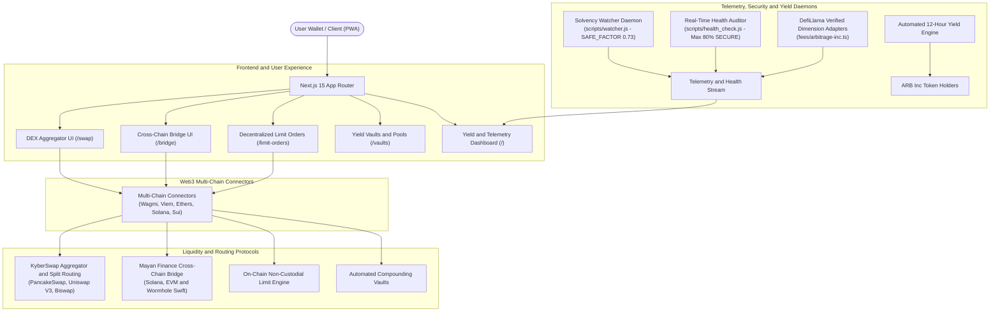

# Arbitrage Inc: All-in-Dex Suite
### Open-Source BSC DEX Aggregator, Cross-Chain Bridge & Real-Yield Terminal

<p align="center">
  
</p>

[](https://github.com/arbincept/Arb-Inc-All-in-Dex/actions)
[](LICENSE)
[](https://bscscan.com)
[](https://nextjs.org)
[](https://defillama.com/protocol/arbitrage-inc)
[](https://github.com/ahmet/awesome-web3/blob/main/README.md#L407)
[](https://github.com/bnb-chain/developer-tools-list/pull/98#issuecomment-5652788720)
[](https://x.com/Arbitrageincept)
[](#)
[](https://github.com/arbincept/Arb-Inc-All-in-Dex)

**Arbitrage Inc: All-in-Dex** is a production-grade, open-source **BSC DEX Aggregator**, cross-chain bridge, limit order client, and real-yield telemetry engine on **BNB Smart Chain (BSC)**. Built with **Next.js 15 (App Router)**, **React 19**, **TypeScript**, **Tailwind CSS**, and **PWA (Progressive Web App)** capabilities.

**Live Application:** [https://arbitrage-inc.exchange](https://arbitrage-inc.exchange)  
**Public API Docs:** [docs/API.md](./docs/API.md)  
**DappBay Project Whitepaper:** [docs/WHITEPAPER.md](./docs/WHITEPAPER.md)
**Security & CSP Policy:** [docs/SECURITY.md](./docs/SECURITY.md)  
**Deployment:** Vercel deployment is connected to the `main` branch of this repository.
**DeFiLlama Protocol:** [https://defillama.com/protocol/arbitrage-inc](https://defillama.com/protocol/arbitrage-inc)  
**Awesome-Web3 Directory:** [Listed in Open Source Project (Line 407)](https://github.com/ahmet/awesome-web3/blob/main/README.md#L407) ([Merged PR #796](https://github.com/ahmet/awesome-web3/pull/796))  
**Automated Security Scan:** [HashDit Bot - Zero Issues Detected (BNB Chain PR #98)](https://github.com/bnb-chain/developer-tools-list/pull/98#issuecomment-5652788720)  
**Smart Contract:** [0x5ee54869ecd5e752c31af095187326d4a4d50e1c (BscScan)](https://bscscan.com/address/0x5ee54869ecd5e752c31af095187326d4a4d50e1c#readContract)  
**Audit & Disclosures:** [AUDIT.md](./AUDIT.md) | **Community:** [Telegram](https://t.me/ArbitrageInception) · [X / Twitter](https://x.com/Arbitrageincept) | **License:** MIT

> [!TIP]
> **Developer & Research Community:** If this codebase saves you development time or helps your Web3 / bot research, please consider leaving a **[Star on GitHub](https://github.com/arbincept/Arb-Inc-All-in-Dex)**! It directly helps maintain open-source indexing across BNB Chain catalogs.

---

## ⚖️ Architecture Separation: Non-Custodial Trading vs Hosted Reward Service

To ensure technical transparency, the platform explicitly decouples trading execution from community reward accounting:

1. **Non-Custodial, Wallet-Based Trading (Swaps & Bridge):**
   - **100% Non-Custodial:** Token swaps (via KyberSwap Aggregator and PancakeSwap V2/V3) and cross-chain bridging (via Mayan Finance & Wormhole Swift) execute directly between the user's Web3 wallet and on-chain decentralized smart contracts.
   - The platform never custodies, routes, or holds user trading capital or private keys.
2. **Hosted Community Loyalty & Rewards Service (Optional Program):**
   - Off-chain point accounting and leaderboard tracking are handled via an Upstash Redis database.
   - Eligible BNB reward payouts from the community treasury reserve are signed and dispatched on-chain via an automated server-held hot signer wallet upon user claim, governed by deterministic solvency boundaries (`SAFE_FACTOR = 0.73`).

---

## 💰 Fee Disclosures & Economics

* **DEX Aggregator Fee:** 0.5% protocol execution fee applied to supported aggregated swaps.
* **ARB INC Token Transfer Tax:** 4% on-chain tax on native `ARB INC` token buys/sells (routed to liquidity pool, protocol reserve, and community BNB reward distributions).
* **Cross-Chain Bridge Fees:** Standard bridge routing fees and source/destination gas apply.
* **Open Source License:** The frontend client and scripts are 100% free and open-source under the permissive MIT License.

---

## 🏛️ Architecture & System Topology



---

## 🚀 Key Platform Capabilities

### 1. Multi-DEX Aggregator & Split-Order Routing (`/swap`, `/swap-all`)
- Routes swaps across multiple BSC decentralized exchanges (including PancakeSwap V2/V3, Uniswap V3, Biswap, and KyberSwap) to achieve optimal price execution, minimal price impact, and slippage protection.
- Smart order splitting algorithms reduce gas overhead and prevent front-running / MEV sandwich attacks.

### 2. Cross-Chain Bridge Integration (`/bridge`)
- Powered by **Mayan Finance** and the **Mayan Swift Protocol** (via Wormhole), allowing users to execute fast, high-liquidity cross-chain swaps between Solana, Ethereum, Arbitrum, Polygon, Avalanche, Optimism, Base, and BNB Smart Chain at optimal rates.

### 3. Non-Custodial Limit Orders (`/limit-orders`)
- Decentralized conditional trade execution on-chain without requiring deposits into centralized orderbooks or third-party custody.
- Direct wallet-to-contract signature authorizations.

### 4. Automated Yield Vaults & Staking Pools (`/vaults`)
- Curated integration with decentralized liquidity pools and auto-compounding strategies, maximizing APY/APR for liquidity providers on BSC.

### 5. 100% Real-Yield Community Distribution Engine
- **Zero Team Allocation, Zero Token Burns:** 100% of accumulated protocol fees and DEX revenue are converted into BNB and directed to the distribution contract.
- **Automated 12-Hour Payouts:** Every 12 hours, 100% of accumulated BNB is distributed programmatically to ARB Inc token holders relative to their wallet balances.

### 6. Real-Time On-Chain Security & Health Watcher Daemons
- **Solvency & Contract Watcher (`scripts/watcher.js`):** Continuously monitors RPC nodes, liquidity pool ratios, and reserve solvency using an algorithmic risk factor (`SAFE_FACTOR = 0.73`).
- **Live Health Status (`scripts/health_check.js`):** Verifies wallet balances, gas reserve health, and system safety thresholds (`<= 80% SECURE`), streaming real-time status directly to the frontend header.

### 7. Verified DeFiLlama Protocol & Fee Telemetry
- Officially verified and tracked on **DeFiLlama** ([arbitrage-inc](https://defillama.com/protocol/arbitrage-inc)) for DEX aggregator volume and protocol revenue.
- Open-source dimension adapter ([DefiLlama/dimension-adapters #6275](https://github.com/DefiLlama/dimension-adapters/pull/6275) & [#9453](https://github.com/DefiLlama/dimension-adapters/pull/9453)) providing transparent, public on-chain fee and real-yield accounting.

### 8. Mobile-First Progressive Web App (PWA)
- **Instant 1-Tap Installation:** Configured with a full PWA manifest (`public/manifest.json`) in `"display": "standalone"` mode, eliminating browser address bars for a clean mobile app experience on iOS and Android.
- **Cross-Platform OS Integration:** Dedicated metadata and assets configured for **iOS Safari** (`apple-touch-icon`, customized `Viewport` and `#8B5CF6` theme colors), **Android Chrome** (192x192 & 512x512 maskable icons), and **Windows** (`browserconfig.xml`).
- **Decentralized Mobile Distribution:** Bypasses centralized mobile app store censorship, arbitrary delistings, and 30% fees, giving users direct non-custodial trading on any mobile browser.
- **High-Contrast Dark Interface:** Styled with Tailwind CSS and Framer Motion for responsive mobile navigation, high contrast readability, and fluid touch interactions.

### 9. Multi-Chain Wallet Connectors
- Universal Web3 authentication supporting MetaMask, Coinbase Wallet, WalletConnect v2, Phantom, OKX, and emerging multi-chain ecosystems (Solana Wallet Adapter, Sui dApp Kit).

### 10. Automated End-to-End Testing Suite
- Playwright automated smoke test suite (`scripts/maintenance/test-pages.mjs` & `playwright.config.ts`) testing critical user journeys, page loading, RPC responsiveness, and UI state integrity.

---

## 🔒 Smart Contract Verification & Technical Disclosures

The ARB Inc token contract ownership has been **permanently renounced** to the zero address (`0x000...dEaD`).

- **Contract Address:** `0x5ee54869ecd5e752c31af095187326d4a4d50e1c`
- **Network:** BNB Smart Chain (BSC)
- **Explorer Verification:** [BscScan Read Contract](https://bscscan.com/address/0x5ee54869ecd5e752c31af095187326d4a4d50e1c#readContract)
- **Immutable Guarantee:** `owner()` returns `0x000000000000000000000000000000000000dEaD`. No entity can mint new tokens, modify tax parameters, pause trading, or alter contract rules.
- **Full Transparency & Disclosures:** See [AUDIT.md](./AUDIT.md) for immutable contract parameters and architecture disclosures.

---

## 🛠️ Tech Stack

| Layer | Technologies |
| :--- | :--- |
| **Framework** | Next.js 15 (App Router), React 19, TypeScript |
| **Styling & Animation** | Tailwind CSS, Framer Motion, Styled-Components |
| **Web3 & Blockchain** | Viem 2, Wagmi 3, Ethers 5, Web3-Onboard, KyberSwap Widgets, Mayan Finance SDK |
| **Infrastructure** | Node.js 22 LTS, Upstash Redis, Vercel Edge Network |
| **Testing & CI** | Playwright E2E Test Runner, Biome Linter |
| **Monitoring** | Custom RPC Watcher Daemons, DeFiLlama Dimension Adapters |

---

## 💻 Getting Started

### Prerequisites
- Node.js 20+
- npm, pnpm, or yarn

### Local Setup
```bash
# Clone repository
git clone https://github.com/arbincept/Arb-Inc-All-in-Dex.git
cd Arb-Inc-All-in-Dex

# Install dependencies
npm install

# Run local development server
npm run dev
```

Open [http://localhost:3000](http://localhost:3000) in your browser.

### Run Automated Smoke Tests
```bash
# Run Playwright automated smoke tests across all routes
node scripts/maintenance/test-pages.mjs
```

---

## 🌐 Ecosystem Integrations & Directory Listings

- **[DefiLlama Protocol Analytics](https://defillama.com/protocol/arbitrage-inc):** Live protocol metrics, DEX volume, and platform revenue tracking (Dimension Adapters: [PR #6275](https://github.com/DefiLlama/dimension-adapters/pull/6275) & [PR #9453](https://github.com/DefiLlama/dimension-adapters/pull/9453)).
- **[Awesome-Web3 Directory](https://github.com/ahmet/awesome-web3):** Officially reviewed and indexed under [Open Source Project (Line 407)](https://github.com/ahmet/awesome-web3/blob/main/README.md#L407) via [Merged PR #796](https://github.com/ahmet/awesome-web3/pull/796).
- **[BNB Chain Developer Tooling](https://github.com/bnb-chain/developer-tools-list/pull/98):** Ecosystem catalog submission, [automated static scan cleared via HashDit Bot (0 issues detected)](https://github.com/bnb-chain/developer-tools-list/pull/98#issuecomment-5652788720).
- **[BNB Chain Awesome Catalog](https://github.com/bnb-chain/awesome/pull/16):** Ecosystem catalog submission ([PR #16](https://github.com/bnb-chain/awesome/pull/16), [automated scan cleared via HashDit Bot](https://github.com/bnb-chain/awesome/pull/16#issuecomment-5686496121)).

---

## ⭐ Support the Project

If you find this open-source suite or any part of the codebase useful for your research, trading bots, or DeFi development, please consider dropping a **Star** on GitHub. It directly supports continuous open-source maintenance, community visibility, and decentralized ecosystem indexing!

[](https://github.com/arbincept/Arb-Inc-All-in-Dex)

---

## ⚖️ Open-Source Architecture & Regulatory Notice (MiCA Recital 22 & July 2026 CASP Framework)

This repository contains free, open-source client software (MIT License) developed and maintained by independent open-source software engineers and researchers.

- **Non-Custodial Client:** This software functions strictly as a graphical user interface (GUI) and computational reference implementation for interacting with autonomous public smart contracts on BNB Smart Chain. It does not constitute a centralized exchange, broker, investment service, or custodial institution.
- **MiCA & D.Lgs. 129/2024 Exemption (Recital 22):** Under **Regulation (EU) 2023/1114 (Markets in Crypto-Assets - MiCA)** and national transposing legislation (**Italian D.Lgs. 129/2024**, following the definitive cessation of the national OAM transitional register on **1 July 2026** under CONSOB / Banca d'Italia oversight), fully decentralized, self-custodial peer-to-contract services provided without intermediaries fall outside the scope of regulated crypto-asset service provider (CASP) licensing requirements.
- **Immutable Smart Contracts:** The token and distribution logic operate on immutable, renounced smart contracts (`0x000...dEaD`) with zero administrative backdoors, minting capabilities, or developer custody.
- **Self-Custodial Operation:** All transactions are executed peer-to-peer directly between the user's non-custodial wallet and autonomous decentralized liquidity pools. Contributors do not hold, manage, or access user funds.

For detailed documentation, see:
- [Privacy Policy](https://arbitrage-inc.exchange/privacy-policy)
- [Terms of Service](https://arbitrage-inc.exchange/terms-of-service)
- [Italian Legal Disclaimer](./DISCLAIMER_IT.md)

---

## 📜 License

Released under the [MIT License](./LICENSE). All community contributions are welcome.

