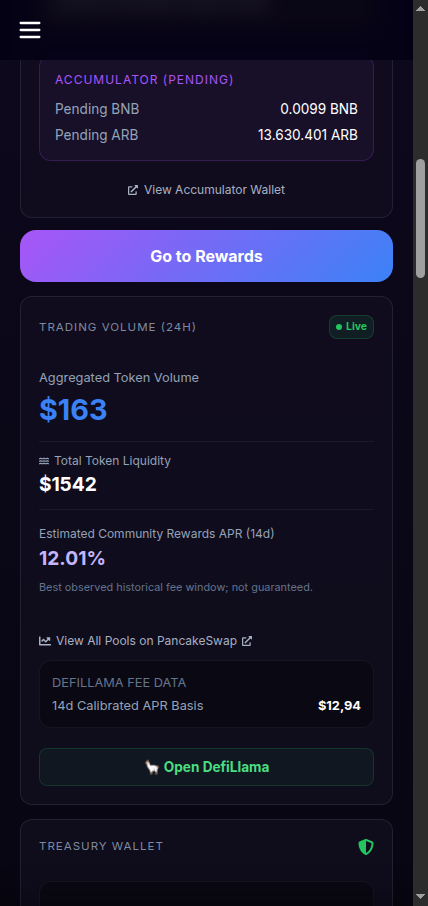

<div align="center">

# Arb-Inc All-in-Dex

**Swap, bridge, and explore DeFi from one open-source interface.**

Built and maintained by **[Luca Celebrano · @Lukecele](https://github.com/Lukecele)**, founder of [Arbitrage Inception](https://github.com/arbincept).

**[Open app](https://arbitrage-inc.exchange)** · **[Star this repository](https://github.com/arbincept/Arb-Inc-All-in-Dex)** · **[Follow Lukecele](https://github.com/Lukecele)**

[Quick start](#quick-start) · [Contribute](#contribute) · [MIT license](LICENSE)

</div>



<sub>Application screenshot from this repository. Live data and available routes change over time.</sub>

## What you can explore

| Feature | Start here |
| :--- | :--- |
| **DEX aggregation** | Compare routed quotes through KyberSwap in the [swap interface](https://arbitrage-inc.exchange/swap-all). |
| **Cross-chain bridging** | Explore EVM and Solana routes through Mayan Finance in the [bridge](https://arbitrage-inc.exchange/bridge). |
| **Limit orders** | Inspect the [limit-order interface](https://arbitrage-inc.exchange/limit-orders) and its wallet authorization flow. |
| **Lending and staking** | Open the [Earn gateway](https://arbitrage-inc.exchange/vaults), which links to the separate Earn application. |
| **Protocol telemetry** | Explore the dashboard and [public DefiLlama metrics](https://defillama.com/protocol/arbitrage-inc). |

Built with **Next.js, React, TypeScript, viem, and wagmi**, with a PWA manifest for mobile installation.

## Try it

1. Open the swap interface and select an input and output asset, such as BNB and USDT.
2. Inspect the quote, route, fees, price impact, and slippage.
3. Connect a wallet and review the transaction before signing if you choose to execute it.

Quotes and supported routes depend on the underlying providers and current liquidity.

## Quick start

Use **Node.js 22+** and **npm**, matching the repository's CI toolchain.

```bash
git clone https://github.com/arbincept/Arb-Inc-All-in-Dex.git
cd Arb-Inc-All-in-Dex
npm ci
npm run dev
```

Open [localhost:3000](http://localhost:3000).

**Configuration:** [.env.example](.env.example) lists provider settings. The hosted leaderboard and reward endpoints also use `UPSTASH_REDIS_REST_URL` and `UPSTASH_REDIS_REST_TOKEN`; reward claims require a server-side signer configured through `PRIVATE_KEY`. Those services need their own deployment configuration. Keep provider secrets and signer keys on the server, outside `NEXT_PUBLIC_*` variables.

### Project checks

```bash
npm test
npm run build
```

The test command covers financial math and Web3 security logic. These commands are also used in [CI](.github/workflows/ci.yml).

## How it fits together

- **Wallet-based trading:** the frontend connects a user's wallet to swap, bridge, and limit-order integrations.
- **Hosted services:** leaderboard and reward accounting use Redis. Eligible reward claims are paid through a server-held signer; this is a separate component from wallet-based trading.
- **Monitoring:** [scripts](scripts/README.md) contain operational tooling; [API documentation](docs/API.md) describes the hosted endpoints.

## Fees and deployment notes

- Supported aggregated swaps apply a **0.5% protocol fee**.
- The **ARB INC token has a 4% transfer tax** on buys and sells.
- Bridge fees and source/destination gas depend on the route.
- Reward amounts and timing depend on reserves, accounting, gas, and service availability.

Read the [contract disclosures](AUDIT.md), [security documentation](docs/SECURITY.md), and [whitepaper](docs/WHITEPAPER.md) for deployment details. Automated scans do not establish a manual audit or guarantee transaction safety.

[Terms](https://arbitrage-inc.exchange/terms-of-service) · [Privacy](https://arbitrage-inc.exchange/privacy-policy) · [Italian disclaimer](DISCLAIMER_IT.md)

## Open-source references

- **DefiLlama:** fee adapter contributions [#6275](https://github.com/DefiLlama/dimension-adapters/pull/6275) and [#9453](https://github.com/DefiLlama/dimension-adapters/pull/9453).
- **Awesome-Web3:** included through [merged submission #796](https://github.com/ahmet/awesome-web3/pull/796).

## Contribute

Reproducible bug reports, clearer documentation, and focused improvements are welcome. Start with an [issue](https://github.com/arbincept/Arb-Inc-All-in-Dex/issues) describing the behavior, environment, and expected result. Include the relevant checks with a pull request.

For sensitive reports, use the organization's [security policy](https://github.com/arbincept/.github/blob/main/SECURITY.md).

## More from Lukecele

This project is part of an independent ecosystem built by **[Luca Celebrano (@Lukecele)](https://github.com/Lukecele)**.

[Inception Flap Scanner](https://github.com/arbincept/inception-flap-scanner) · [BSC Arbitrage Scanner](https://github.com/arbincept/bsc-arbitrage-scanner) · [Arbitrage Inc Earn](https://github.com/arbincept/arbitrage-inc-earn)

If this project helps you, **[give it a star](https://github.com/arbincept/Arb-Inc-All-in-Dex)** and **[follow Lukecele](https://github.com/Lukecele)** for future builds. [Sponsorship](https://github.com/sponsors/Lukecele) helps support ongoing work.

[Telegram](https://t.me/ArbitrageInception) · [Updates on X](https://x.com/Arbitrageincept) · [MIT license](LICENSE)
