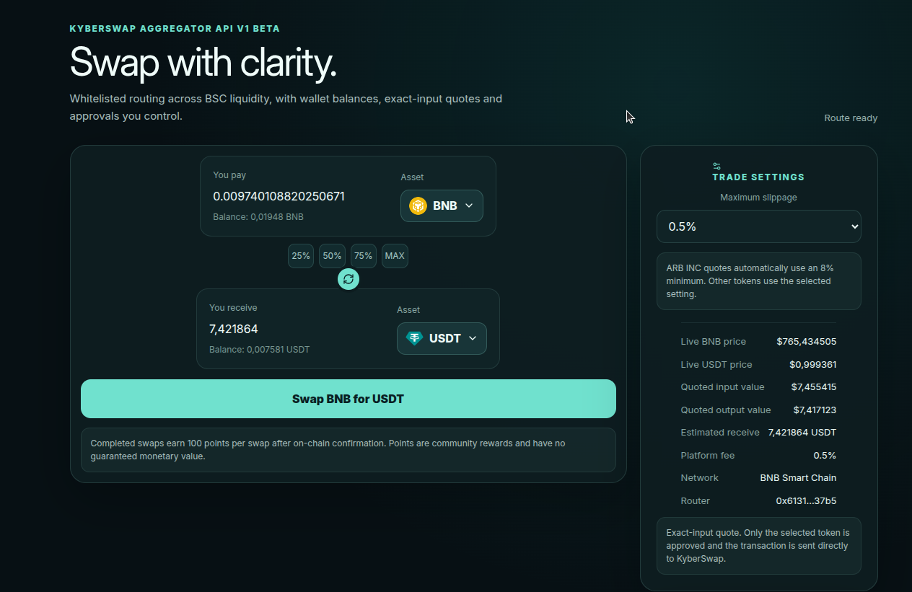

# BNB → USDT quote preview

## What the screenshot shows

This image was supplied by the maintainer and is reproduced unchanged. It shows BNB as the input asset, USDT as the output asset, “Route ready”, estimated output, maximum slippage, a 0.5% platform fee, the BNB Smart Chain network and a shortened router address.

Displayed amounts, balances and prices are a captured snapshot. They depend on provider responses and liquidity and should not be treated as a current quote. The image does not show a transaction receipt or a full breakdown of the liquidity pools along the route.

## Try the interface

Open the public [swap page](https://arbitrage-inc.exchange/swap-all), select BNB and USDT, enter an amount and connect a wallet to request a quote. Inspect the quoted output, fees, price impact, slippage and available routing information before deciding whether to execute a transaction.

The current [quote-request effect](../app/swap-all/BetaSwapClient.tsx) requires a wallet address. [The token list](../lib/swap/constants.ts) includes BNB and USDT. Wallet-based trading and the hosted reward service remain separate components, as described in the README.

## Asset

- Screenshot: [public/demo/swap-quote.png](../public/demo/swap-quote.png), supplied by the maintainer.
- The screenshot replaces the earlier storyboard in the README. Video work is deferred at the maintainer's request.
