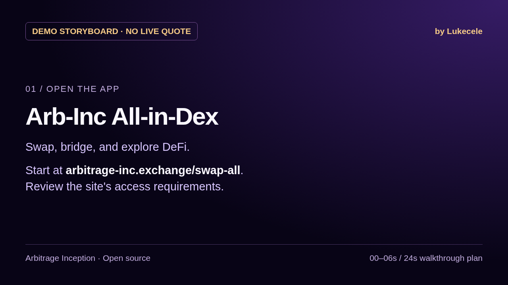

# Swap demo: capture status and storyboard

**Status: storyboard only. A live BNB/USDT quote and route have not been recorded.**

[Watch the 24-second storyboard](../public/demo/swap-storyboard.webm) · [Editable storyboard](demo-storyboard.html)



## What was verified

On 1 October 2026, the public [swap page](https://arbitrage-inc.exchange/swap-all) loaded in Chromium. It displayed BNB and ARB INC as the initial pair, an empty quote and a disabled “Connect wallet to swap” button. The first visit also displayed the site's risk, jurisdiction, sanctions and terms confirmations. These were left unsubmitted; no wallet was connected and no transaction was approved, signed or sent.

The current [quote-request effect](../app/swap-all/BetaSwapClient.tsx) returns early without a wallet address, an amount, or a valid token pair. [The token list](../lib/swap/constants.ts) includes BNB and USDT. A wallet connection is therefore required before a quote can be recorded. This session did not establish an API outage: no quote request was made.

The video is a sequence of editorial storyboard cards, not a screen recording of a completed swap or a live quote. It contains no example price, invented route, wallet balance or transaction result.

## Capture plan: 24 seconds

| Time | Action to record | What viewers should see |
| :--- | :--- | :--- |
| 00–06s | Open the public swap page after personally reviewing and completing applicable access confirmations. | The real swap interface and URL. |
| 06–12s | Select BNB → USDT and enter an amount. Connect a wallet that the recorder is authorized to use. | The selected assets and amount; no approval or transaction signature. |
| 12–18s | Wait for an actual provider response. | The quoted output, route, fees, price impact and slippage available in the interface. |
| 18–24s | Pause on the quote and end the recording. | The quote remains visible; the recorder does not execute the swap. |

If the provider rejects the request or the UI does not expose the requested route details, capture the actual message and keep this storyboard labelled as pending. Do not replace missing data with simulated results. Quotes and routes change with provider availability and liquidity.

## Assets and reproduction

- Poster: `public/demo/swap-storyboard-poster.png` (1280×720).
- Video: `public/demo/swap-storyboard.webm` (24 seconds, 1280×720, silent).
- Editable source: [demo-storyboard.html](demo-storyboard.html), using the project's purple palette and the editorial signature “by Lukecele”.
- Render `demo-storyboard.html?step=1` through `?step=4` at 1280×720, one PNG per step. The first frame is the poster.
- With the four frames named `step-1.png` through `step-4.png`, encode the storyboard using:

```bash
ffmpeg -framerate 1/6 -start_number 1 -i step-%d.png \
  -t 24 -vf fps=24 -c:v libvpx-vp9 -b:v 0 -crf 32 -pix_fmt yuv420p \
  swap-storyboard.webm
```

The source contains no external fonts or scripts. Replacing this storyboard with a live capture requires a separate recording of the real interface; relabelling these cards would not satisfy that requirement.
